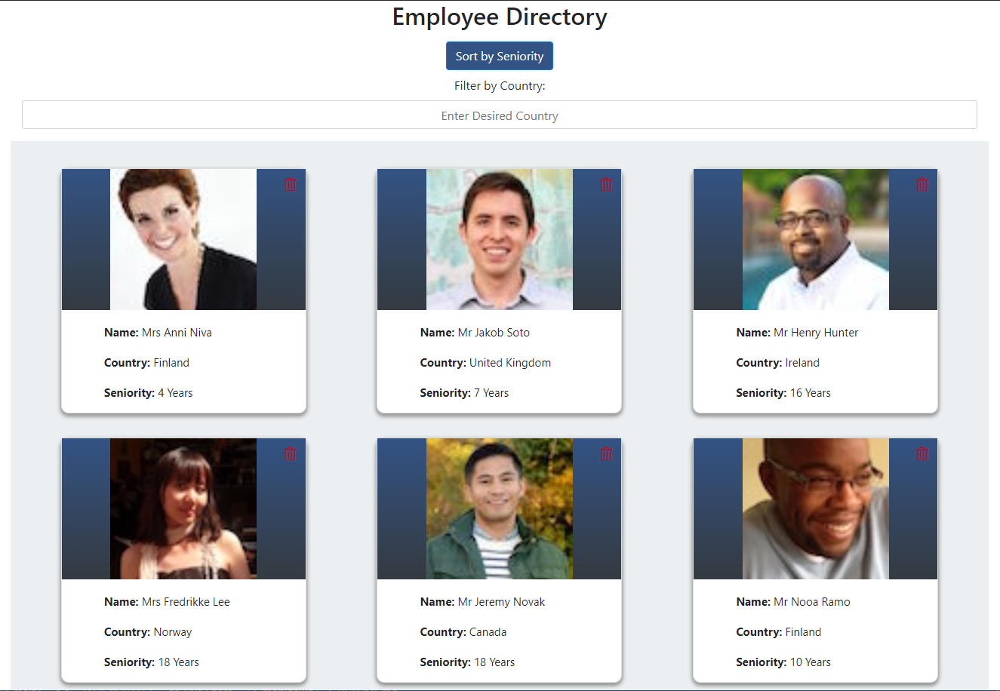

# React Employee Directory
## Description
Employee Directory system built in React.  Utilizes a random user API to bring in a new set of "employees" each run.  Once loaded, employees can be sorted by seniority and filtered by country.  
## Table of Contents
- [Installation](#installation)
- [Usage](#usage)
- [Contributing](#contributing)
- [Tests](#tests)
- [License](#license)
- [Questions](#questions)
- [Screenshot](#screenshot)
- [Screen Recording](#screen-recording)
- [Application](#application)
## Installation
npm i
## Usage
npm start
## Contributing
None
## Tests
None
## License
The_Unlicense

For information on this license, please follow [this link](https://choosealicense.com/licenses/unlicense/)
## Questions
Contact the author with questions via GitHub or email at

[JonPointer at GitHub](https://github.com/JonPointer) jonpointer@msn.com
## Screenshot

## Screen Recording
[Screen Recording](https://drive.google.com/file/d/1ADK0FupMB3HaFHsulRI3zi1-g_njk9kV/view)
## Application
[Deployed to GitHub Pages](https://jonpointer.github.io/react-employee-directory/)